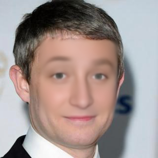

# Filling the Gaps on Faces

- Original U2Net Model updated to output 3 channel and loss function altered to L1Loss.

- Training is done on Celeba-HQ dataset for ~150K iteration.

- Final L1Loss on training dataset 0.060407.

- Best model can be found [here.](u2net_gap_filling_for_faces.pth)

## Results

Original Image             |  Masked Image |  Model Result
:-------------------------:|:-------------------------:|:-------------------------:
  |   |  
  |   |  
  |   |  
  |   |  

